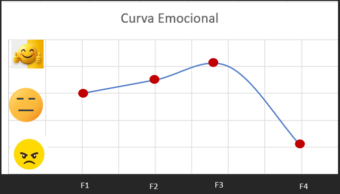

**Tabla en Markdown**

|  | **F1 - Anhelo** | **F2 - Solución** | **F3 - Escuchar la música** | **F4 - Consideración** |
|---|---|---|---|---|
| **Acciones** | Quiere hacer más agradables sus viajes escuchando música, pero no le gusta escuchar las mismas canciones siempre. | Lo resuelve descargando algunas canciones antes de salir desde su computadora. | Como pasa gran parte de su tiempo fuera de casa, utiliza la música. | Se recuerda que debe priorizar gastos como el transporte y la alimentación antes que una suscripción de música. |
| **Pensamientos** | *"Muchas veces quiero escuchar música mientras viajo y no puedo hacerlo por falta de internet."* | *"Si siempre escucho las mismas canciones termino aburriéndome."* | *"Hay días en los que paso más de cinco horas escuchando música."* | *"El precio mensual no es una prioridad para mí."* |
| **Emoción** | Deseo | Satisfecha | Satisfecha | Decepción |
| **Puntos de dolor** | N/A | Tener como única alternativa descargar música en su computadora. Por el momento funciona, pero quizás más adelante ya no. | Conformarse con la música que tiene descargada, aunque en algún momento le llegue a aburrir. | Recordarse que pagar una suscripción musical aún no es prioridad y que todavía puede mantenerse con lo que tiene. |

**Curva Emocional**

