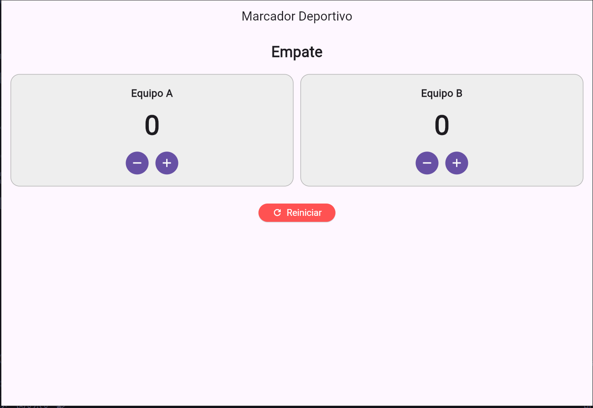
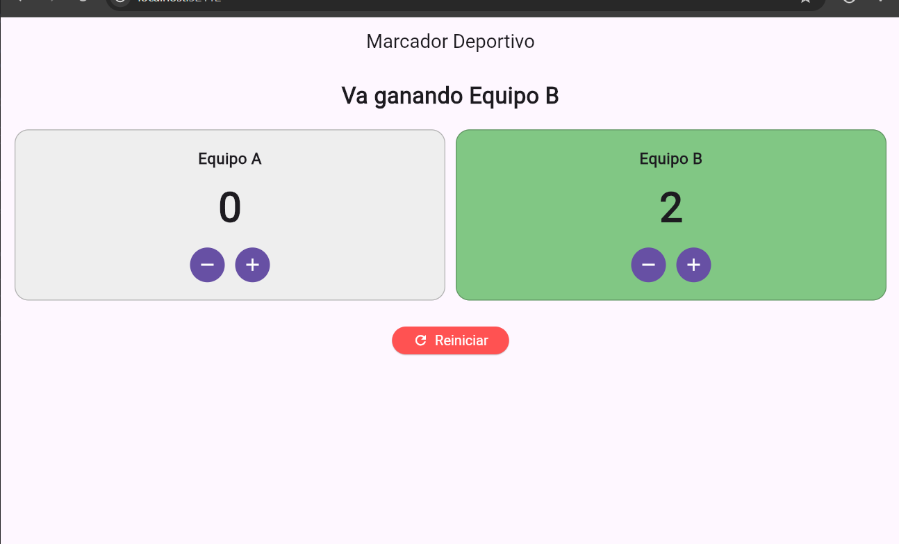

# Laboratorio: Marcador Deportivo

Aplicación Flutter que implementa un marcador deportivo con dos equipos,
botones de +1 / -1, mensaje de resultado dinámico, color destacado para
el equipo que va ganando y botón de reinicio.

## Capturas de la aplicación

- Equipo ganando: 
- Empate: 

## Pregunta: ¿Qué hace `setState` cuando presiono un botón y qué ocurriría si cambio los puntos sin llamarlo?

Cuando se presiona un botón (por ejemplo, +1 del Equipo A), dentro del
callback se modifica la variable `puntosA` y esa modificación se relaciona
en `setState(() { ... })`. Al llamar `setState`, Flutter marca el widget
como "sucio" (*dirty*) y programa una reconstrucción (`build`) del árbol de
widgets de ese `State`. Durante ese nuevo `build`, la interfaz vuelve a
leer los valores actuales de `puntosA` y `puntosB`, calcula el mensaje
("Empate" o "Va ganando ..."), el color de cada tarjeta y los números que
se muestran en pantalla, de modo que el usuario ve el cambio en el instante.

Si se cambiara el valor de `puntosA` o `puntosB` directamente, sin llamar
a `setState` (por ejemplo, escribiendo solo `puntosA++;` fuera de ese
bloque), la variable sí cambiaría en memoria, pero Flutter no se enteraría
de que el estado cambió: no se programaría una reconstrucción del widget y
la pantalla seguiría mostrando los valores anteriores. La app quedaría
"desincronizada" entre el estado real (la variable) y lo que el usuario ve,
hasta que ocurriera otra reconstrucción por cualquier otro motivo (por
ejemplo, girar la pantalla), momento en que se vería el valor
correcto.
